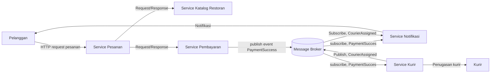
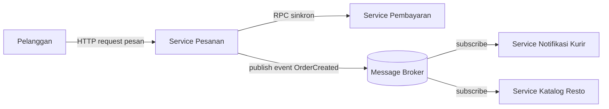

# Tugas 2 (Pekan 2) — Perancangan Arsitektur untuk FoodGo

**Materi terkait:** Architectural style (Layered, SOA, Peer-to-Peer, Publish-Subscribe).

## Studi Kasus

Melanjutkan Tugas 1: FoodGo butuh sistem yang **decoupled** agar tim kurir dan tim resto tidak saling mengganggu ketika salah satu modul diperbarui/deploy ulang. Saat ini semua modul (pesanan, pembayaran, notifikasi kurir, katalog resto) berjalan sebagai satu aplikasi monolitik — sekali deploy, semua modul ikut restart dan berisiko downtime total.

## Tugas Kelompok

1. Pilih **satu** gaya arsitektur utama: **Service-Oriented Architecture (SOA)** atau **Publish-Subscribe**. Boleh dikombinasikan (mis. SOA untuk service inti + Pub-Sub untuk notifikasi), tapi harus dijustifikasi kenapa kombinasi ini yang dipilih.
2. Gambarkan minimal 4 komponen berikut dan interaksinya: modul Pesanan, modul Pembayaran, modul Kurir/Notifikasi, modul Katalog Resto (dan message broker/API gateway jika relevan).
3. Jelaskan alur satu skenario penuh secara end-to-end di diagram (misalnya: pelanggan buat pesanan → bayar → resto terima notifikasi → kurir ditugaskan) — tunjukkan komponen mana berkomunikasi dengan siapa, dan **jenis komunikasinya** (sinkron/asinkron, request-response/event).
4. Analisis tertulis: kenapa gaya ini mengatasi masalah *coupling* dari Tugas 1, dan apa trade-off-nya (mis. Pub-Sub menambah kompleksitas debugging karena alur tidak linear).

## Jawab
1. FoodGo menggunakan Service-Oriented Architecture (SOA) sebagai gaya arsitektur utama, yang dikombinasikan dengan Publish-Subscribe untuk komunikasi berbasis event.
Pada SOA, fungsi utama FoodGo dipisahkan menjadi beberapa service, seperti Order Service, Payment Service, Courier/Notification Service, dan Restaurant Catalog Service. Setiap service dapat dikembangkan, diperbarui, dan di-deploy secara lebih independen.
Publish-Subscribe digunakan untuk proses yang tidak harus menunggu respons secara langsung, misalnya pengiriman notifikasi ketika pembayaran berhasil atau ketika pesanan baru masuk ke restoran. Alasan memilih: karena dapat mengurangi ketergantungan antar-modul sehingga perubahan atau gangguan pada satu service tidak langsung menyebabkan seluruh sistem ikut berhenti

2. - Order Service: mengelola pembuatan dan status pesanan pelanggan
   - Payment Service: memproses pembayaran dan memberikan status pembayaran
   - Courier/Notification Service: mengelola penugasan kurir dan mengirimkan notifikasi
   - Restaurant Catalog service: menyediakan informasi restoran, menu, harga, dan ketersediaan makanan.
   - Message Broker: menyampaikan event dari satu service ke service lain secara asynchronous

3. skenario: pelanggan membuat pesanan hingga kurir ditugaskan
   - Pelanggan memilih menu dan mengirim pesanan ke order service
   - order service meminta menu dan harga dari restaurant catalog service
   - setelah pesanan dibuat, order service meminta payment service untuk memproses pembayaran
   - payment service memproses pembayaran dan mengirimkan hasilnya kembali ke order service
   - jika pembayaran berhasil, payment service menerbitkan event PaymentSucces ke Message Broker
   - Restaurant/Notification Service menerima event tersebut secara asynchronous dan dapat mengirimkan informasi bahwa pesanan perlu diproses.
   - Courier Service menerima event yang relevan dan mencari/menugaskan kurir.
   - Setelah kurir ditugaskan, sistem mengirimkan notifikasi kepada pelanggan.
Jenis Komunikasi:
Customer: Order Service;	Sinkron/request-response
Order Service: Catalog Service;	Sinkron/request-response
Order Service: Payment Service;	Sinkron/request-response
Payment Service: Message Broker;	Asinkron/event
Message Broker: Notification Service;	Asinkron/event
Message Broker: Courier Service;	Asinkron/event

4. Arsitektur SOA + Publish-Subscribe mengurangi coupling karena setiap modul dipisahkan menjadi service yang dapat berjalan dan diperbarui secara independen. Message Broker juga membuat beberapa komunikasi tidak perlu dilakukan secara langsung antar-service.
Trade-off: Arsitektur ini mengurangi ketergantungan, tetapi membuat sistem lebih kompleks dan proses debugging lebih sulit karena komunikasi antar-service berlangsung melalui beberapa komponen

## Diagram FoodGo




## Cara Membuat Diagram (Gratis, Cukup Laptop)

Tidak perlu software berbayar. Dua opsi:

**Opsi A — Mermaid di dalam Markdown (disarankan).** Ditulis sebagai teks biasa di `README.md`, otomatis dirender jadi diagram oleh GitHub — tidak perlu install apa pun.

````markdown

````

**Opsi B — draw.io / diagrams.net** (gratis, jalan di browser tanpa akun, atau app desktop offline di [app.diagrams.net](https://app.diagrams.net/)). Ekspor sebagai `.png` dan simpan di folder `diagram/`.

## Struktur Submission

```
tugas-02-perancangan-arsitektur/
├── README.md          # Analisis + diagram Mermaid (jika Opsi A) atau referensi ke diagram/
├── JURNAL.md
└── diagram/            # File .png/.drawio jika pakai Opsi B
```

## Rubrik Penilaian (Tugas 2)

| Komponen | Bobot | Kriteria |
|---|---|---|
| Ketepatan pemilihan gaya arsitektur | 20% | Justifikasi SOA/Pub-Sub sesuai kebutuhan *decoupling* di skenario |
| Kelengkapan & kejelasan diagram | 30% | Semua komponen kunci ada, jenis komunikasi (sinkron/asinkron) jelas ditandai |
| Analisis trade-off | 30% | Bukan hanya kelebihan — kekurangan/kompleksitas baru juga dibahas |
| Proses & kontribusi kelompok | 20% | `JURNAL.md`, commit history |

## Batasan Penggunaan AI (Level 2)

Kebijakan **Level 2 (AI Assisted Idea Generation & Structuring)** berlaku — lihat [`../RUBRIK-UMUM.md`](../RUBRIK-UMUM.md). Boleh memakai AI untuk brainstorming komponen apa saja yang umum ada di gaya arsitektur SOA/Pub-Sub; **tidak boleh** meminta AI menggambar diagram final atau menuliskan analisis trade-off yang tinggal ditempel. Catat pemakaian AI di "Log Penggunaan AI" pada `JURNAL.md`.

- Diagram Mermaid/draw.io yang "terlalu generik" (identik dengan contoh tutorial di internet tanpa penyesuaian ke kasus FoodGo) akan dinilai rendah pada komponen kelengkapan & kejelasan diagram.
